# Frontend Mentor - E-commerce product page solution

This is a solution to the [E-commerce product page challenge on Frontend Mentor](https://www.frontendmentor.io/challenges/ecommerce-product-page-UPsZ9MJp6).

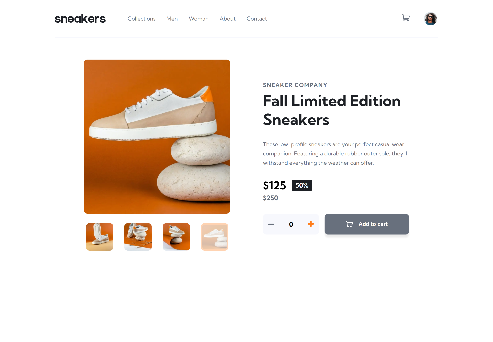

## Table of contents

- [Overview](#overview)
  - [The challenge](#the-challenge)
  - [Screenshots](#screenshots)
    - [Mobile and Desktop Layout](#mobile-and-desktop-layout)
    - [Product](#product)
    - [Add items to shopping cart](#add-items-to-shopping-cart)
    - [Shopping cart](#shopping-cart)
    - [Hover states](#hover-states)
  - [Tests](#tests)
    - [Unit and Integration Tests](#unit-and-integration-tests)
    - [E2E Tests](#e2e-tests)
    - [Accessibility Tests](#accessibility-tests)
  - [Links](#links)
  - [Built with](#built-with)
- [Author](#author)

## Overview

### The challenge

Users should be able to:

- View the optimal layout for the site depending on their device's screen size
- See hover states for all interactive elements on the page
- Open a lightbox gallery by clicking on the large product image
- Switch the large product image by clicking on the small thumbnail images
- Add items to the cart
- View the cart and remove items from it

### Screenshots

#### Mobile and Desktop Layout

1. Mobile layout

   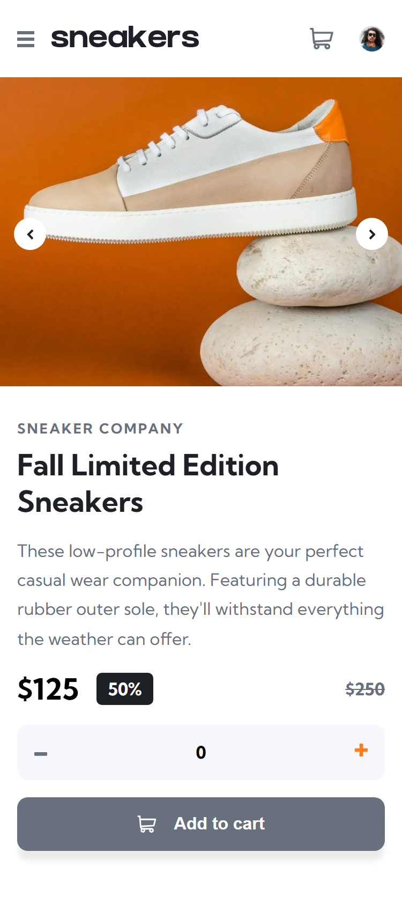

   1.1 Mobile Navigation

   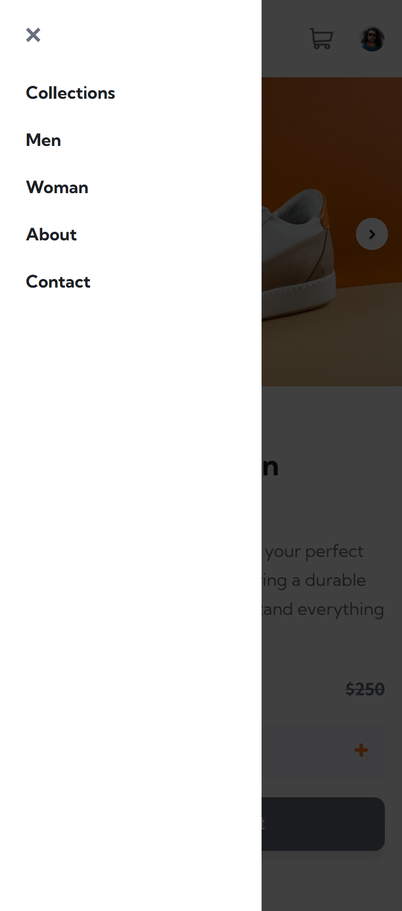

2. Desktop layout

   

#### Product

1. Product gallery

   1.1 Mobile screens - Clicking on the prev/next buttons will cycle the product images.

   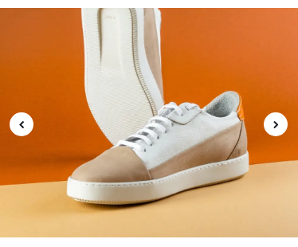

   1.2 Desktop screens: Clicking on the thumbnail items will change the current product image.

   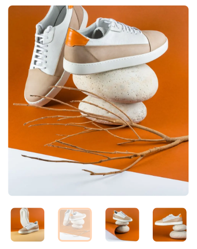

2. Product lightbox gallery (Desktop screens)

   Clicking on the current product image will open the lightbox gallery.

   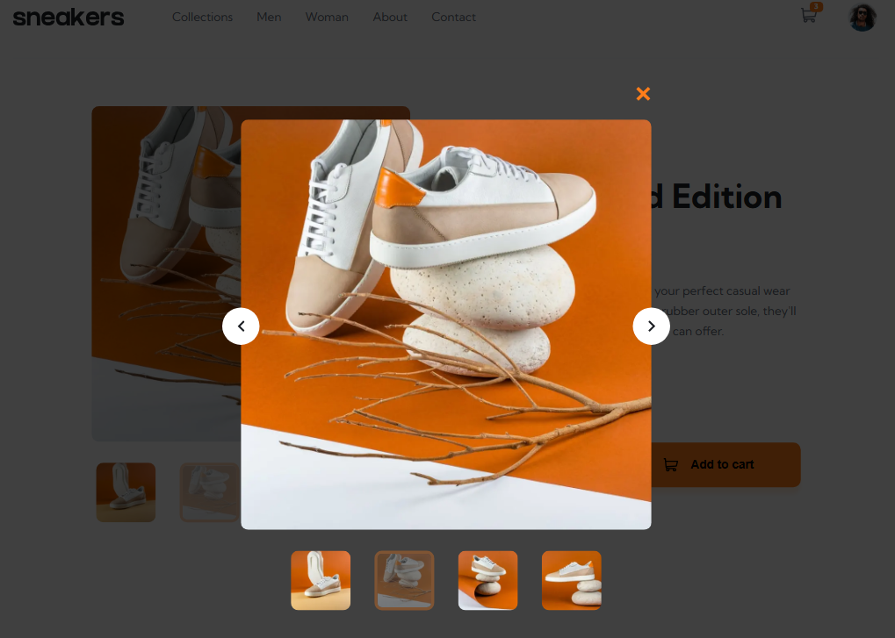

#### Add items to shopping cart

As the default behavior, the "decrease quantity" counter button and "add to cart" button are disabled and have a gray color.

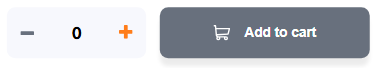

To be able to add items to the shopping cart, the user needs to click the "increase quantity" button and then the "Add to cart" button.

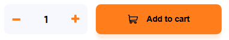

#### Shopping cart

1. Empty cart

   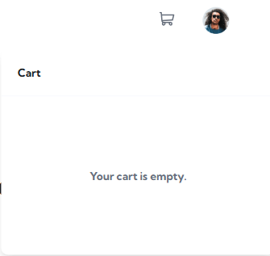

2. Items badge

   When the cart has items, a badge will appear above the user cart icon.

   

3. Cart with items

   Clicking the user cart icon, the shopping cart pop-up will appear.

   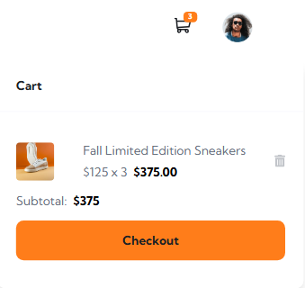

4. Remove items

   To remove an item, the user needs to click the "Remove item" button.

   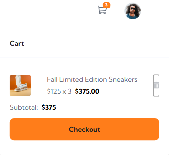

#### Hover states

1. Main Navigation

- Links

  

- User shopping cart icon

  

- User profile

  

2. Product

- Gallery (thumbnail items)

  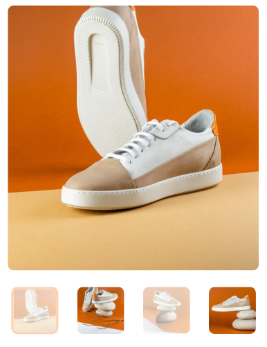

- Lightbox gallery (close, prev/next buttons and thumbnail items)

  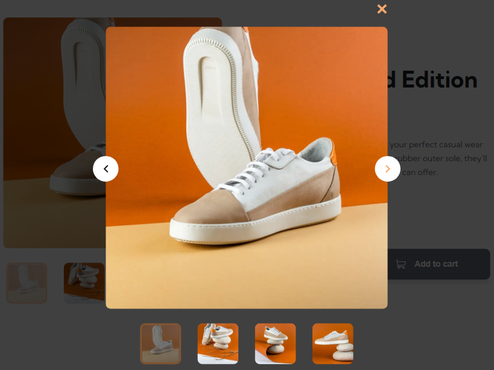

3. Counter and Add to cart buttons

- Counter buttons

  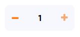

- Add to cart button

  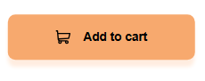

4. User Shopping Cart

- Delete item button

  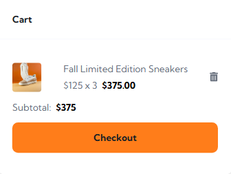

- Checkout button

  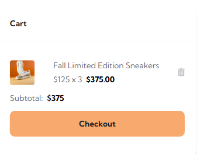

### Tests

#### **Unit and Integration Tests**

This project uses Jest and React Testing Library for unit and integration testing.

The unit tests cover:

- The rendering of the components

The integration tests cover:

- Not allowing the user to add a product to cart if product counter is 0
- Allowing the user to increase the product counter value
- Allowing the user to add a product to cart

#### **E2E Tests**

This project uses Playwright for end to end testing.

The E2E tests cover:

1. Mobile only (Pixel 5 and iPhone 12):

- Opening and closing the mobile navigation
- Browsing the product gallery using the next/previous buttons

2. Desktop only (Chromium, Firefox and Webkit):

- Browsing the product gallery using the thumbnail list
- Browsing the modal product gallery using the next/previous buttons or thumbnail list
- Closing the modal product gallery by pressing the close button or escape key

3. All viewport tests:

- Displaying a message when the cart is empty
- Adding an item to cart
- Removing an item from cart

#### **Accessibility Tests**

1. Automated Tests

- Run Lighthouse audits in Chrome and Edge DevTools (98 value score).

2. Manual Tests

- Screen Reader testing with NVDA:
  - Checked that headings (h1, h2, h3) are announced correctly.
  - Checked that all section content is announced correctly.
  - Checked that the buttons: "Previous Product Image", "Next Product Image", thumbnail items, "Decrease quantity", "Increase quantity", "Add to cart", "Remove Item" and "Checkout" are read when focused.

### Links

- Solution URL: [https://github.com/f29pereira/sneakers](https://github.com/f29pereira/sneakers)
- Live Site URL: [https://f29pereira.github.io/sneakers/](https://f29pereira.github.io/sneakers/)

### Built with

- Semantic HTML5 markup
- CSS custom properties
- Flexbox
- Mobile-first workflow
- TypeScript
- [Next.js](https://nextjs.org/) - React framework
- [React](https://reactjs.org/) - JS library
- [React Developer Tools](https://react.dev/learn/react-developer-tools) - browser extension
- [clsx](https://www.npmjs.com/package/clsx) - Utility for constructing className strings conditionally.
- [focus-trap-react](https://www.npmjs.com/package/focus-trap-react) - React component that traps focus
- [Redux Toolkit](https://redux-toolkit.js.org/) - Redux state management
- [Redux DevTools](https://github.com/reduxjs/redux-devtools) - browser extension
- [Jest](https://jestjs.io/) - JS testing library
- [React Testing Library](https://testing-library.com/) - React components testing library
- [user-event](https://www.npmjs.com/package/@testing-library/user-event) - companion library of React Testing Library
- [Playwright](https://playwright.dev/) - automation library for end-to-end testing
- [NVDA (NonVisual Desktop Access)](https://www.nvaccess.org/) - open-source screen reader for Windows

## Author

- Frontend Mentor - [@f29pereira](https://www.frontendmentor.io/profile/f29pereira)
