# Frontend Mentor - E-commerce product page solution

This is a solution to the [E-commerce product page challenge on Frontend Mentor](https://www.frontendmentor.io/challenges/ecommerce-product-page-UPsZ9MJp6).

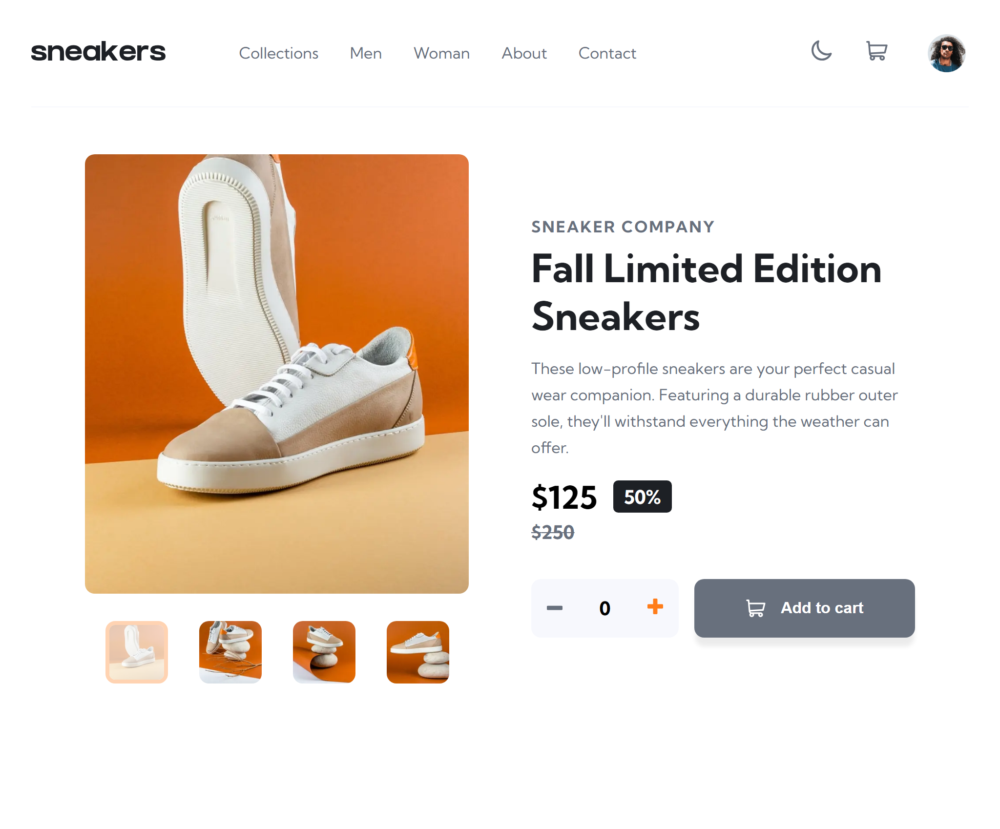

## Table of contents

- [Overview](#overview)
  - [The challenge](#the-challenge)
  - [Screenshots](#screenshots)
    - [Responsive Layout](#responsive-layout)
    - [Dark Theme](#dark-theme)
    - [Product](#product)
    - [Add items to shopping cart](#add-items-to-shopping-cart)
    - [Shopping cart](#shopping-cart)
    - [Hover states](#hover-states)
  - [Tests](#tests)
    - [Unit and Integration Tests](#unit-and-integration-tests)
    - [E2E Tests](#e2e-tests)
    - [Accessibility Tests](#accessibility-tests)
  - [Links](#links)
  - [My process](#my-process)
    - [Built with](#built-with)
    - [What I learned](#what-i-learned)
- [Author](#author)

## Overview

### The challenge

Users should be able to:

- View the optimal layout for the site depending on their device's screen size
- See hover states for all interactive elements on the page
- Open a lightbox gallery by clicking on the large product image
- Switch the large product image by clicking on the small thumbnail images
- Add items to the cart
- View the cart and remove items from it

Additional features:

- Toggle the light/dark app theme
- When the product quantity is 0 the "Decrease quantity" and "Add to cart" buttons are disabled and greyed out
- Show toast notifications when successfully adding or removing an item from the cart

### Screenshots

#### Responsive Layout

This project features a responsive design, built with with a "mobile-first" approach.

1. Mobile layout

   1.1 Small Screens

      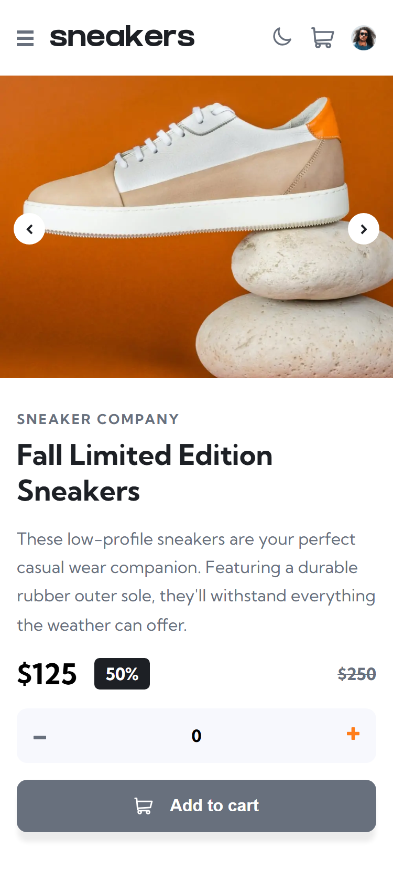
      
      - Mobile Navigation

      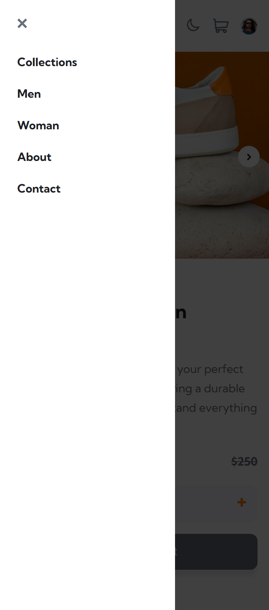

   1.2 Tablet Screens

      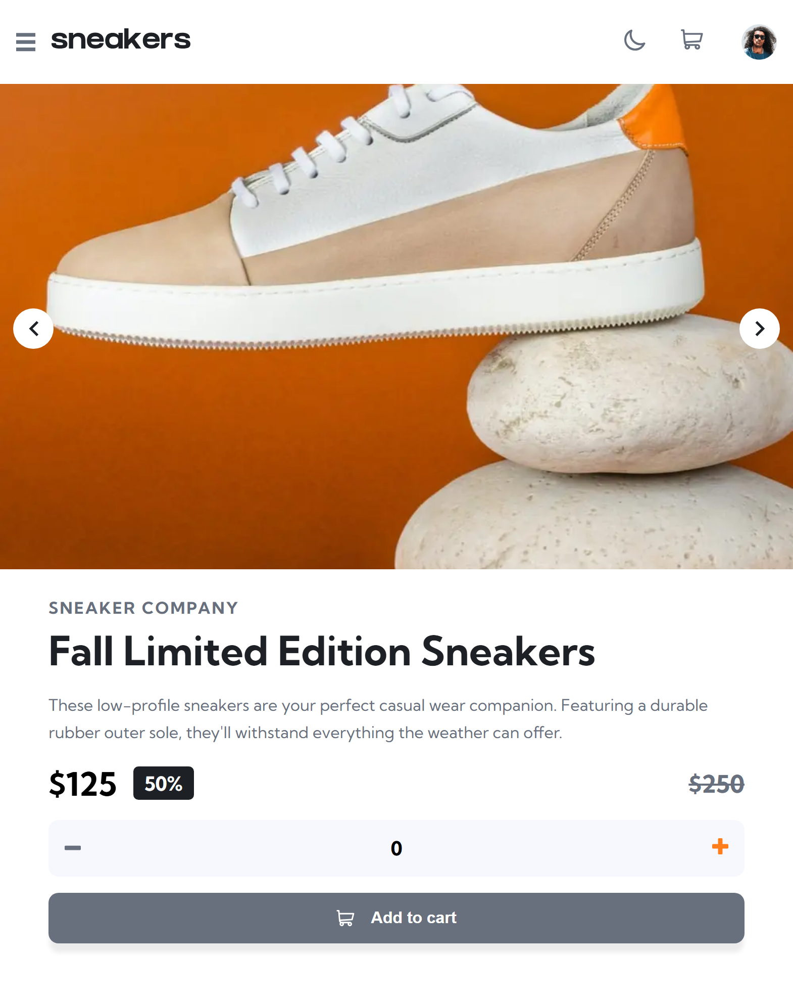

2. Desktop layout

   

#### Dark Theme

Clicking the theme toggle button allows the users to change the app's theme.

1. Mobile layout

   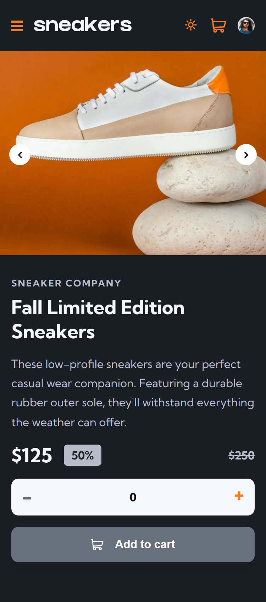

   1.1 Mobile Navigation

    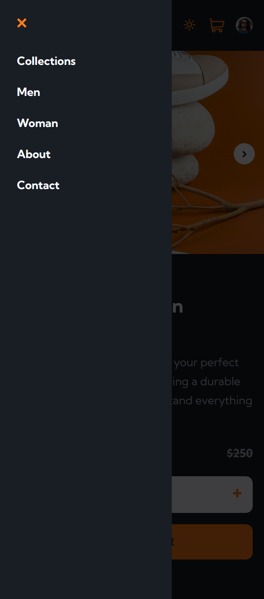

2. Desktop layout

   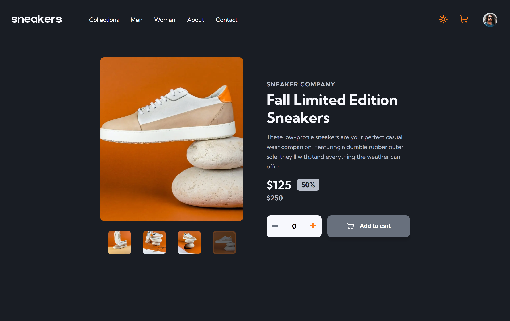

#### Product

1. Product gallery

   1.1 Mobile screens - Clicking on the prev/next buttons will cycle the product images.

   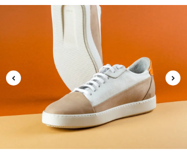

   1.2 Desktop screens: Clicking on the thumbnail items will change the current product image.

   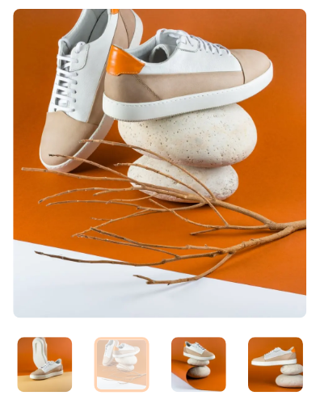

2. Product lightbox gallery (Desktop screens)

   Clicking on the current product image will open the lightbox gallery.

   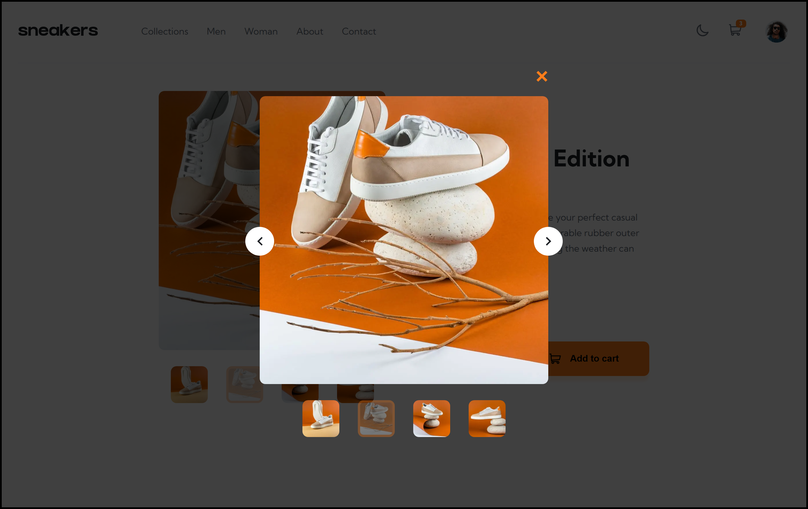

#### Add items to shopping cart

As the default behavior, the "decrease quantity" counter button and "add to cart" button are disabled and greyed out.

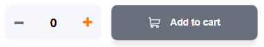

To be able to add items to the shopping cart, the user must click the "increase quantity" button and then the "Add to cart" button.

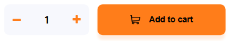

After adding an item to the shopping cart, a toast notification will appear. After 3 seconds, this notification will automatically disappear, or the user can close it by clicking the "Close Notification" button.

- Mobile Layout: notification appears in the center of the screen.

  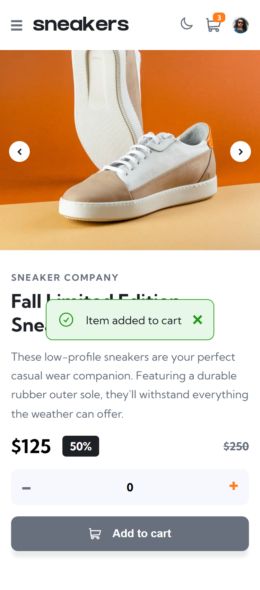

- Desktop Layout: notification appears below the shopping cart icon.

  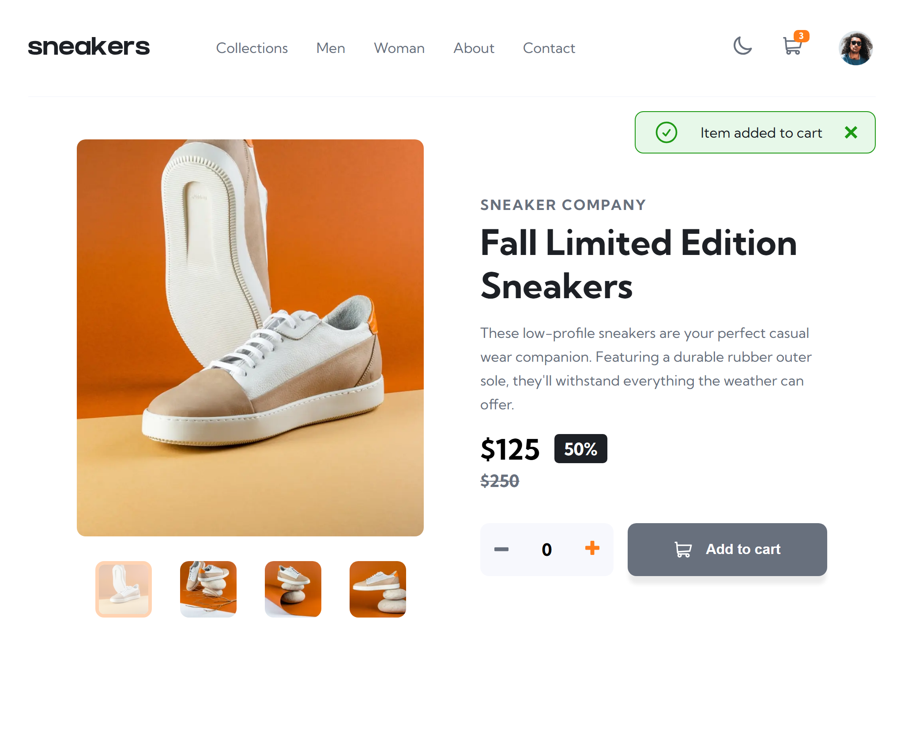

#### Shopping cart

1. Empty cart

   1.1 Light theme

   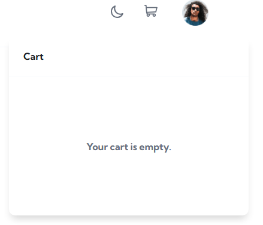

   1.2 Dark theme

   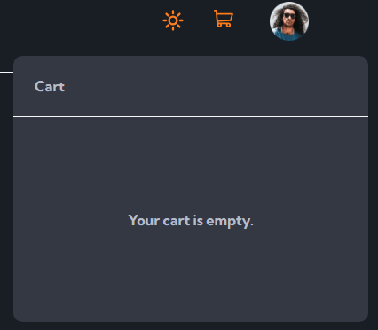

2. Items badge

   When the cart has items, a badge will appear above the user cart icon.

   1.1 Light theme

   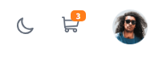

   1.2 Dark theme

   

3. Cart with items

   Clicking the user cart icon, the shopping cart pop-up will appear.

   1.1 Light theme

   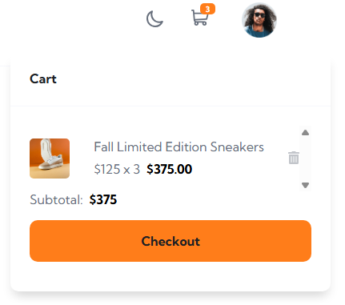

   1.2 Dark theme

   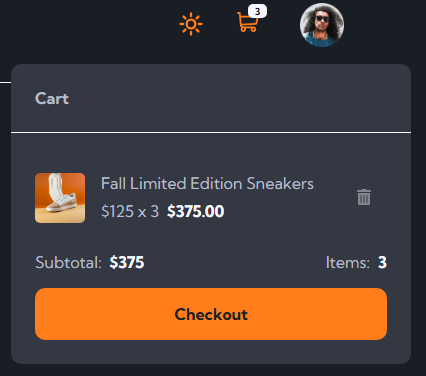

4. Remove items

   To remove an item, the user needs to click the "Remove item" button.

   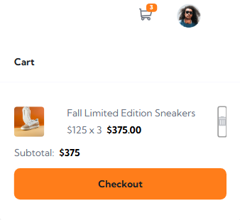

   After removing an item from the shopping cart, a toast notification will appear. After 5 seconds, this notification will automatically disappear, or the user can close it by clicking the "Close Notification" button.
   - Mobile Layout: notification appears in the center of the screen.

     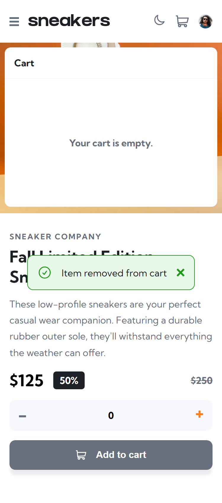

   - Desktop Layout: notification appears below the shopping cart icon.

     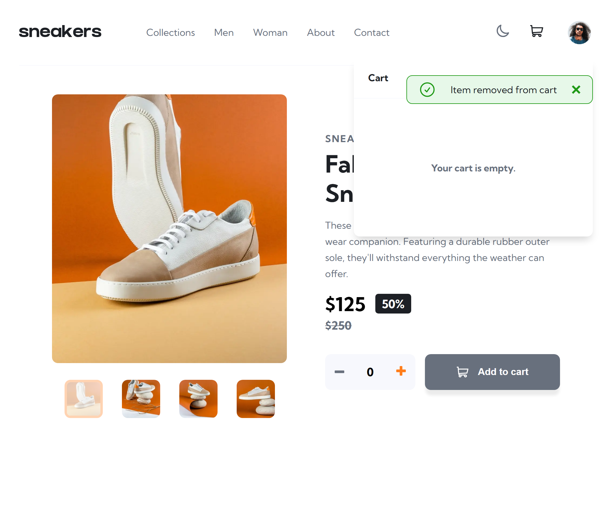

#### Hover states

1. Main Navigation

- Links

  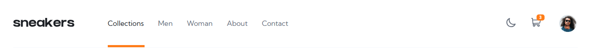

- Theme toggle

  Light Theme

  

  Dark Theme

  

- User shopping cart icon

  Light Theme

  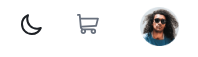

  Dark Theme

  

- User profile

  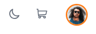

2. Product

- Gallery (thumbnail items)

  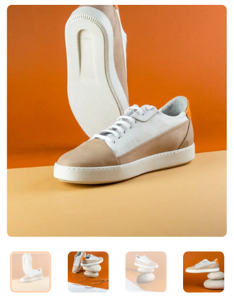

- Lightbox gallery (close, prev/next buttons and thumbnail items)

  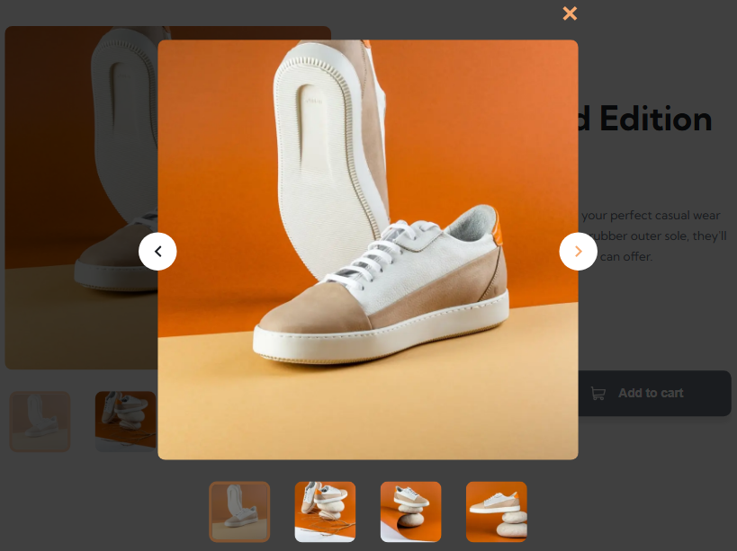

3. Counter and Add to cart buttons

- Counter buttons

  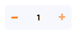

- Add to cart button

  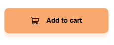

4. User Shopping Cart

- Delete item button

  Light Theme

  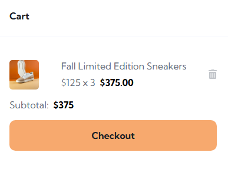

  Dark Theme

  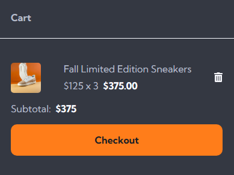

- Checkout button

  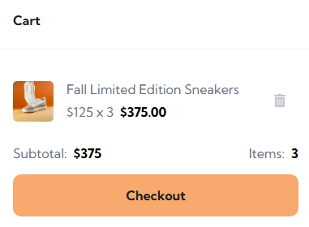

### Tests

#### **Unit and Integration Tests**

This project uses Jest and React Testing Library for unit and integration testing.

The unit tests cover:

- The rendering of the components

The integration tests cover:

- Not allowing the user to add a product to cart if product counter is 0
- Allowing the user to increase the product counter value
- Allowing the user to add a product to cart

#### **E2E Tests**

This project uses Playwright for end to end testing.

The E2E tests cover:

1. Mobile only (Pixel 5 and iPhone 12):

- Opening and closing the mobile navigation
- Browsing the product gallery using the next/previous buttons

2. Desktop only (Chromium, Firefox and Webkit):

- Browsing the product gallery using the thumbnail list
- Browsing the modal product gallery using the next/previous buttons or thumbnail list
- Closing the modal product gallery by pressing the close button or escape key

3. All viewport tests:

- Displaying a message when the cart is empty
- Adding an item to cart and displaying a notification
- Removing an item from cart and displaying a notification
- Toggling the light and dark app theme

#### **Accessibility Tests**

1. Automated Tests

- Run Lighthouse audits in Chrome and Edge DevTools (100 score).

2. Manual Tests

- Screen Reader testing with NVDA:
  - Checked that headings (h1, h2, h3) are announced correctly.
  - Checked that all section content is announced correctly.
  - Checked that all buttons are read when focused.
  - Checked that all notifications are announced assertively when they appear on screen.

### Links

- Solution URL: [https://github.com/f29pereira/sneakers](https://github.com/f29pereira/sneakers)
- Live Site URL: [https://f29pereira.github.io/sneakers/](https://f29pereira.github.io/sneakers/)

### Built with

- Semantic HTML5 markup
- CSS custom properties
- Flexbox
- Mobile-first workflow
- TypeScript
- [heroicons](https://heroicons.com/outline) - collection of MIT open source interface icons for web and app development
- [Next.js](https://nextjs.org/) - React framework
- [React](https://reactjs.org/) - JavaScript library
- [React Developer Tools](https://react.dev/learn/react-developer-tools) - browser extension
- [clsx](https://www.npmjs.com/package/clsx) - Utility for constructing className strings conditionally
- [focus-trap-react](https://www.npmjs.com/package/focus-trap-react) - React component that traps focus
- [Redux Toolkit](https://redux-toolkit.js.org/) - Redux state management
- [Redux DevTools](https://github.com/reduxjs/redux-devtools) - browser extension
- [Jest](https://jestjs.io/) - JavaScript testing library
- [React Testing Library](https://testing-library.com/) - React components testing library
- [user-event](https://www.npmjs.com/package/@testing-library/user-event) - companion library of the React Testing Library
- [Playwright](https://playwright.dev/) - automation library for end-to-end testing
- [NVDA (NonVisual Desktop Access)](https://www.nvaccess.org/) - open-source screen reader for Windows

### What I learned

- Use the focus-trap-react package to capture focus on the mobile navigation and desktop lightbox gallery
- Use the clsx package to easily manage the components classnames, like the Add To Cart component that changes the button color based on the product counter value
- Use React's useReducer hook to manage the app notifications when adding/removing items from the cart
- Create E2E tests using Playwright for mobile/desktop only and all screens tests
- Create Git Actions jobs for unit/integration and E2E tests to run automatically during pull requests on the master branch

## Author

- Frontend Mentor - [@f29pereira](https://www.frontendmentor.io/profile/f29pereira)
